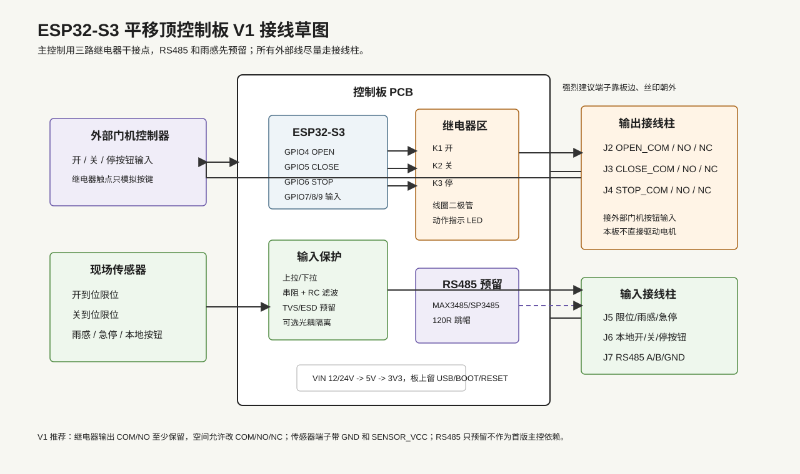

# Ascom Alpaca ESP32 Dome Board

ESP32-S3 firmware for controlling a roll-off-roof / sliding dome top through the ASCOM Alpaca protocol.

This trimmed version keeps only the Dome control path:

- Alpaca Dome discovery and API endpoints
- Web page for Dome state and Open / Close / Halt commands
- Web setup for Dome pins and timeout settings
- WiFi manager connection flow
- OTA firmware and filesystem updates

Switch and CoverCalibrator modules have been removed from the firmware, web UI, SPIFFS defaults, and Alpaca device discovery.

## ESP32-S3 Dome I/O

The current firmware uses fixed GPIO definitions in `src/board_pins.h`:

| Signal | GPIO |
| --- | --- |
| Open command relay trigger | 4 |
| Close command relay trigger | 5 |
| Stop / halt command relay trigger | 6 |
| Open limit input | 7 |
| Close limit input | 8 |
| Reserved rain sensor input | 9 |

The three relay outputs are intended to pulse external isolated trigger inputs for open, close, and stop. The rain sensor header is initialized as an input and reported in diagnostics, but it does not automatically close the dome until the sensor polarity and desired safety behavior are defined.

The web setup page still stores the original dome configuration file for compatibility, but the active control pins are the fixed GPIO constants above.

Detailed hardware notes are in `docs/esp32-s3-dome-board-hardware.md`.



## Build

Install Visual Studio Code and the PlatformIO extension, then open this folder as a PlatformIO project.

From the command line:

```sh
pio run
```

To build the SPIFFS image:

```sh
pio run --target buildfs
```

## First Upload

Use PlatformIO:

1. Upload Filesystem Image
2. Upload firmware

On first boot, connect to the WiFi manager access point and configure the board for your observatory WiFi.

## Web Interface

After the board joins WiFi, open the ESP32 IP address in a browser.

- `/` shows Dome status and Open / Close / Halt controls.
- `/setup` shows Dome configuration.
- `/update` is provided by ElegantOTA for firmware and filesystem updates.

## ASCOM Alpaca

The board listens for Alpaca discovery on UDP `32227` and serves Alpaca device requests on port `4567`.

Only one configured device is advertised:

- Device type: `Dome`
- Device number: `0`

Useful endpoints include:

- `GET /management/apiversions`
- `GET /management/v1/description`
- `GET /management/v1/configureddevices`
- `GET /api/v1/dome/0/shutterstatus`
- `PUT /api/v1/dome/0/openshutter`
- `PUT /api/v1/dome/0/closeshutter`
- `PUT /api/v1/dome/0/abortslew`

## Verification

Current smoke check:

```sh
pio run
```
