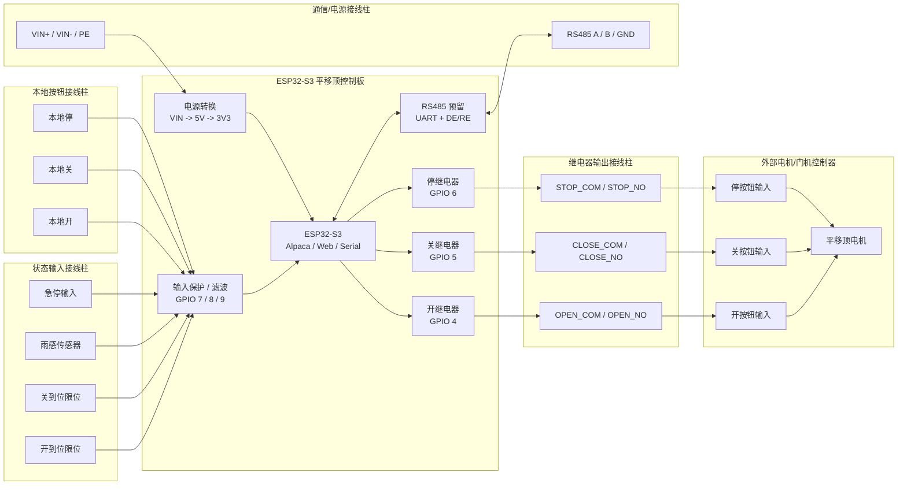

# ESP32-S3 平移顶控制板硬件设计建议

本文档记录当前控制板的建议硬件方案。目标是用 ESP32-S3 控制天文台平移顶，通过 ASCOM Alpaca / Web / 串口命令触发开顶、关顶、停止，并为雨感、急停和 RS485 扩展预留接口。

## 设计结论

第一版建议采用：

- 三路继电器干接点作为主控制输出：开、关、停。
- 两路限位输入作为核心状态反馈：开到位、关到位。
- 一路雨感输入预留，先只做状态采集，不直接自动关顶。
- 一路急停输入预留，优先级高于所有软件命令。
- RS485 作为扩展接口预留，不作为第一版主控制依赖。

这样做的好处是兼容性高、调试简单、现场故障容易定位，同时保留后续接 Modbus RTU、PLC 或智能电机控制器的空间。

## 接线框图

下面是第一版建议的直观接线结构。ESP32-S3 控制板负责网络、状态机和继电器触发；外部电机控制器仍然负责真正的大功率电机动作。



核心理解：

- 左边继电器输出只是模拟按钮，不直接驱动电机。
- 下方限位、雨感、急停、本地按钮都走低压输入端子。
- RS485 只是预留扩展，不影响第一版三继电器控制。
- 电源输入、继电器触点、低压输入尽量分区放置。

## 固件引脚定义

当前固件固定使用 `src/board_pins.h` 中的板级引脚定义：

| 功能 | GPIO | 方向 | 说明 |
| --- | --- | --- | --- |
| Open relay trigger | GPIO 4 | 输出 | 开顶继电器触发 |
| Close relay trigger | GPIO 5 | 输出 | 关顶继电器触发 |
| Halt relay trigger | GPIO 6 | 输出 | 停止继电器触发 |
| Open limit | GPIO 7 | 输入 | 开到位限位 |
| Close limit | GPIO 8 | 输入 | 关到位限位 |
| Rain sensor | GPIO 9 | 输入 | 雨感预留输入 |

继电器输出在上电初始化时会被拉低，避免启动瞬间误触发。

## 控制输出

### 推荐形式

三路输出建议使用继电器干接点：

- `OPEN_RELAY`: 模拟外部控制器的“开”按钮。
- `CLOSE_RELAY`: 模拟外部控制器的“关”按钮。
- `STOP_RELAY`: 模拟外部控制器的“停”按钮。

干接点不要把本板 GND 或电源直接带到外部电机控制器。这样可以兼容更多门机、卷帘门控制板、PLC 输入和自制控制箱。

### 继电器驱动建议

每路继电器建议包含：

- ESP32-S3 GPIO 驱动三极管或 MOSFET。
- 线圈反灌保护二极管。
- 继电器动作 LED。
- 触点侧使用接线端子引出 `COM` / `NO`，必要时可增加 `NC`。
- 继电器线圈供电与 MCU 电源做好去耦。

如果空间允许，可以选用光耦继电器或信号继电器。普通机械继电器最直观，现场维护也方便。

### 触发时间

当前固件的开/关/停继电器脉冲约为 1 秒。后续可以把脉冲时间做成配置项：

| 输出 | 建议可配置范围 |
| --- | --- |
| 开继电器 | 200 ms - 2000 ms |
| 关继电器 | 200 ms - 2000 ms |
| 停继电器 | 200 ms - 2000 ms |

有些控制器只需要短按，有些控制器需要稍长按压，保留可配置会更稳。

## 状态输入

### 限位输入

至少需要两路限位输入：

- `OPEN_LIMIT`: 屋顶完全打开。
- `CLOSE_LIMIT`: 屋顶完全关闭。

建议输入侧做以下保护：

- 明确上拉或下拉，不让输入悬空。
- 串联限流电阻。
- RC 滤波，减少长线干扰。
- TVS 或 ESD 保护。
- 必要时使用光耦隔离。

平移顶电机附近干扰较多，限位线又可能比较长，输入保护比“能读到电平”更重要。

### 状态判定

固件当前按两路限位组合判断状态：

| 开限位 | 关限位 | 状态 |
| --- | --- | --- |
| 有效 | 无效 | 已打开 |
| 无效 | 有效 | 已关闭 |
| 有效 | 有效 | 运动中或停止在中间 |
| 无效 | 无效 | 异常状态 |

实际硬件接线时要确认限位开关是常开还是常闭，并让固件读取到的电平符合这个状态表。后续如果改用常闭安全回路，建议同步调整固件状态表和文档。

## 雨感接口

建议预留一路雨感输入端子：

- `RAIN_SENSOR`
- `GND`
- `3V3` 或 `5V`，按传感器模块选择

雨感模块常见输出有两类：

- 数字量输出：干湿阈值由模块电位器决定。
- 模拟量输出：湿度程度由 ADC 读取。

第一版建议先接数字量输入，因为逻辑简单、可靠性高。固件目前只初始化雨感输入并在诊断中报告引脚，不自动关顶。等确认传感器输出极性后，再决定：

- 雨感触发时禁止开顶。
- 雨感触发且屋顶未关闭时自动关顶。
- 雨感触发后需要人工确认才能重新开顶。

雨感属于安全相关输入，不建议第一版在没有现场验证的情况下直接自动动作。

## 急停和安全联锁

建议预留急停输入，优先级高于 Web、Alpaca、串口和自动逻辑。

推荐策略：

- 急停触发时立即断开开/关继电器输出。
- 急停触发时允许或强制触发停继电器，取决于外部控制器逻辑。
- 急停解除后不自动恢复动作，需要新的人工命令。

更保守的硬件方案是增加继电器输出总使能，使急停能在硬件层面切断所有运动命令。软件停机很好，但硬件急停更可靠。

## RS485 预留

RS485 不建议作为第一版主控制输出，但强烈建议预留。

### 适合 RS485 的场景

- 外部电机控制器支持 Modbus RTU。
- 后续要接 PLC。
- 需要读取更多状态，例如电机故障码、电流、速度、门机状态。
- 设备距离较长，现场干扰较重。

### 不适合作为第一版主控制的原因

- 必须知道并维护对方协议。
- 不同控制器协议差异大。
- 调试复杂度高于开关量。
- 更换电机控制器时固件可能也要改。

### 硬件预留建议

预留一组 UART 给 RS485 收发器，例如 MAX3485 / SP3485：

| 信号 | 说明 |
| --- | --- |
| TXD | ESP32-S3 UART TX |
| RXD | ESP32-S3 UART RX |
| DE/RE | 方向控制 GPIO |
| A | RS485 A |
| B | RS485 B |
| GND | 通信参考地 |

板上建议增加：

- 120R 终端电阻，使用跳帽或拨码开关启用。
- 偏置电阻位置，按总线实际情况决定是否焊接。

## PCB 布局约束

当前 JLCEDA 生产候选页面为 `ascom_dome` / `Board3_1` / `PCB3`，按低成本 2 层板方向整理：

- 板框约为 `3600 mil x 3450 mil`，控制在常见低价打样尺寸内。
- 四角预留 M3 安装孔，孔径约 `3.4 mm`，非金属化孔。
- 上边放限位/雨感/RS485 预留端子，底边放 `5V IN` 和 USB-C，右边放三路继电器干接点端子，方便现场压线。
- 三路继电器触点输出使用较粗走线，低压 GPIO/传感器信号使用细线。
- RS485 收发器、120R 终端电阻作为预留/可不焊方案，第一版不依赖 RS485。
- ESP32-S3-WROOM 天线区域在文档层标出；正式下单前必须以 live `PCB3` 重新确认无铜、无走线、无过孔、无器件。

当前 JLCEDA 外设布局预览见 [pcb3_outer_io_current_simplified.svg.png](/Users/kalec/Desktop/Ascom-Alpacha-ESP32-Switch-Borad-Dome-Board/hardware/jlceda/out/pcb3_outer_io_current_simplified.svg.png)。

JLCEDA `PCB3` 是当前目标生产候选。此前 live `PCB3` 已完成嘉立创/LCSC 器件、M3 孔位避让、开路检查和铜间距检查；但当前 `R1/R2` 边距修正仍停留在脚本侧，JLCEDA 客户端/bridge 断开后还没有写入并读回确认。正式下单前仍需重新连接、应用当前脚本、同步原理图网表并重新跑 UI DRC。JLCEDA 客户端不可用时，仓库里还保留一份本地 KiCad 机械/布局基线，便于继续检查板框、M3 孔位、端子位置和成本策略：

- KiCad PCB: [esp32_s3_dome_controller.kicad_pcb](/Users/kalec/Desktop/Ascom-Alpacha-ESP32-Switch-Borad-Dome-Board/hardware/kicad/esp32_s3_dome_controller.kicad_pcb)
- 当前交付索引: [esp32-s3-dome-board-delivery.md](/Users/kalec/Desktop/Ascom-Alpacha-ESP32-Switch-Borad-Dome-Board/docs/esp32-s3-dome-board-delivery.md)
- KiCad 预览图: [kicad-esp32-s3-dome-controller-preview.svg](/Users/kalec/Desktop/Ascom-Alpacha-ESP32-Switch-Borad-Dome-Board/docs/kicad-esp32-s3-dome-controller-preview.svg)
- KiCad DRC 报告: [drc.rpt](/Users/kalec/Desktop/Ascom-Alpacha-ESP32-Switch-Borad-Dome-Board/hardware/kicad/out/drc.rpt)
- KiCad Gerber/Drill 草包: [fab](/Users/kalec/Desktop/Ascom-Alpacha-ESP32-Switch-Borad-Dome-Board/hardware/kicad/out/fab)
- KiCad Gerber/Drill 草包 ZIP: [esp32_s3_dome_controller_fab_preview.zip](/Users/kalec/Desktop/Ascom-Alpacha-ESP32-Switch-Borad-Dome-Board/hardware/kicad/out/esp32_s3_dome_controller_fab_preview.zip)
- V1 BOM 成本草表: [esp32-s3-dome-board-bom.csv](/Users/kalec/Desktop/Ascom-Alpacha-ESP32-Switch-Borad-Dome-Board/docs/esp32-s3-dome-board-bom.csv)
- 标准化器件分配表: [esp32-s3-dome-board-standard-parts.md](/Users/kalec/Desktop/Ascom-Alpacha-ESP32-Switch-Borad-Dome-Board/docs/esp32-s3-dome-board-standard-parts.md)
- 标准化器件 CSV: [esp32-s3-dome-board-standard-parts.csv](/Users/kalec/Desktop/Ascom-Alpacha-ESP32-Switch-Borad-Dome-Board/docs/esp32-s3-dome-board-standard-parts.csv)
- 嘉立创/LCSC 物料候选 BOM: [esp32-s3-dome-board-jlc-bom.csv](/Users/kalec/Desktop/Ascom-Alpacha-ESP32-Switch-Borad-Dome-Board/docs/esp32-s3-dome-board-jlc-bom.csv)
- 嘉立创/LCSC 物料核对记录: [esp32-s3-dome-board-jlc-source-check.md](/Users/kalec/Desktop/Ascom-Alpacha-ESP32-Switch-Borad-Dome-Board/docs/esp32-s3-dome-board-jlc-source-check.md)
- JLCEDA 收尾清单: [esp32-s3-dome-board-jlceda-finish-checklist.md](/Users/kalec/Desktop/Ascom-Alpacha-ESP32-Switch-Borad-Dome-Board/docs/esp32-s3-dome-board-jlceda-finish-checklist.md)
- 封装替换映射表: [esp32-s3-dome-board-footprint-map.csv](/Users/kalec/Desktop/Ascom-Alpacha-ESP32-Switch-Borad-Dome-Board/docs/esp32-s3-dome-board-footprint-map.csv)
- 投板/装配注意事项: [esp32-s3-dome-board-fab-notes.md](/Users/kalec/Desktop/Ascom-Alpacha-ESP32-Switch-Borad-Dome-Board/docs/esp32-s3-dome-board-fab-notes.md)
- 坐标文件: [esp32_s3_dome_controller_pos.csv](/Users/kalec/Desktop/Ascom-Alpacha-ESP32-Switch-Borad-Dome-Board/hardware/kicad/out/esp32_s3_dome_controller_pos.csv)

这份 KiCad 文件是离线备份基线，不替代 JLCEDA `PCB3` 正式投板文件。此前 JLCEDA `PCB3` 已记录以下候选状态，bridge 恢复后必须用当前脚本重新复验：

- 使用嘉立创/LCSC 器件源；此前 `scripts/jlceda_verify_lcsc_parts.mjs` 确认 30 个器件的 `supplierId` 均匹配预期。
- 标准化器件已经固定在 `docs/esp32-s3-dome-board-standard-parts.md` 和 `.csv`，用于约束 FIT/DNP、替代料和下单前检查。
- `J5/R8/U2` 作为 RS485 预留默认不进 BOM，其余 V1 必需器件进 BOM。
- USB-C 已靠底边并朝外，`J1 5V IN` 同在底边；J2/J3/J4 继电器输出端子靠右边。
- J6/J7/J8/J5 位于上边，分别用于开限位、关限位、雨感和 RS485 预留。
- 非母线类信号走线已改为 45 度倒角；`5V/GND/3V3/RS485` 这类公共母线保持直连，避免倒角切断分支汇合点。
- `J1/J6/J7/J8` 已从四角 M3 孔附近让开；此前 `scripts/jlceda_verify_mounting_clearance.mjs` 检查四个孔周围器件、走线、过孔命中均为 `0`。
- 此前 `scripts/jlceda_find_open_nets_layered.mjs` 检查 `openNetCount: 0`。
- 此前 `scripts/jlceda_check_clearance.mjs` 检查线/焊盘、线/线、线/过孔、过孔/过孔冲突均为 `0`。
- 此前 JLCEDA `pcb_Drc.check(true, false, true)` 检查无 clearance、slot、connection 等物理布线错误；`P2.Schematic3` 已按 `PCB3` 修正继电器 pinout、RS485 A/B、USB/EN 和外壳 GND，直接 Ref.Pin 比对显示 `103` 个 P2 有网引脚与 `103` 个 PCB3 有网焊盘完全一致。当前只剩 1 条 JLCEDA UI generic `Netlist Error / Import Changes` 同步项；正式下单前需要先应用当前 `R1/R2` 脚本修正，再清掉该 UI 项并重新跑 DRC。

当前 KiCad 备份布局已完成以下内容：

- 板框约 `91.44 mm x 87.63 mm`，控制在 `100 mm x 100 mm` 以内。
- 四角 M3 非金属化安装孔已预留。
- 电源输入、限位/雨感输入、RS485 预留和三路继电器干接点端子均靠板边布置。
- ESP32-S3-WROOM 天线禁布区已在 PCB `Dwgs.User` 层标注；正式换官方封装时，天线端必须朝板边，禁布区内不能有铜皮、走线、过孔或器件。
- 三路继电器触点侧已使用较粗走线，输入侧和控制侧使用细走线。
- 已补入输入端子、雨感、GND、5V、3V3、三路继电器驱动、RS485 A/B 和 USB-C 调试口的布线。
- 已新增 `J9 USB-C DEVICE`，作为 ESP32-S3 原生 USB 下载/调试口；`VBUS` 接 5V，`D-`/`D+` 接 ESP32-S3 USB 引脚，`CC1`/`CC2` 各接 5.1k 下拉。
- `J1 5V IN` 已保留为外部 5V 接线柱输入，并在板上补充 `GND +5V IN` 丝印，避免现场接线只看编号。
- DRC 未发现短路、交叉、clearance、hole-clearance 或 solder-mask-bridge 硬错误。
- DRC 当前未连接项为 `0`，严格错误检查为 `0`。
- KiCad 备份完整 DRC 仍有 `34` 条 `lib_footprint_mismatch` 警告，来源是生成的 `Codex:*` 占位封装；若单独用 KiCad 备份投板，必须先替换成嘉立创/立创 EDA 可采购封装。此前 JLCEDA `PCB3` 已用真实 LCSC 封装完成候选构建，但当前仍需 bridge 恢复后复验。

### 成本优化建议

- 第一版保持 2 层板，不做 4 层板。
- 板子尺寸继续压在 `100 mm x 100 mm` 内。
- RS485 相关器件可标注为 DNP，现场确认需要后再焊；其中 `R8 120R` 终端电阻建议第一版默认 DNP。
- 端子尽量统一间距和型号，减少 BOM 种类。
- 继电器只引出 `COM/NO`，如果现场确认不需要 `NC`，不额外增加三位端子。
- M3 孔使用普通非金属化安装孔，不做沉金、半孔等特殊工艺。
- 贴装电阻优先用嘉立创 Basic 0603：`100R C22775`、`10k C25804`、`120R C22787`、`5.1k C23186`。

### KiCad 备份 PCB 状态

已完成：

- 板框恢复到 PCB 内部的 Board Outline 层。
- 四角 M3 安装孔已放入 PCB。
- 三路继电器干接点输出已布到底层端子：`OPEN_COM/NO`、`CLOSE_COM/NO`、`STOP_COM/NO`。
- 继电器线圈低端到 MOSFET/续流二极管的本地连接已整理。
- 5V 和 3V3 已完成一部分电源主干。
- R4/R5/R6 已移到 ESP32-S3 附近并旋转，使输入信号焊盘朝向 MCU，降低端子区拥挤度。
- `OPEN_LIMIT_GPIO7`、`CLOSE_LIMIT_GPIO8`、`RAIN_GPIO9` 已从端子经底层走线接到 ESP32-S3 输入和上拉电阻。
- R1/R2/R3 已重新摆放到 MOSFET gate 附近，三路 `OPEN_GATE`、`CLOSE_GATE`、`STOP_GATE` 已接到 MOSFET 门极。
- `OPEN_GPIO4`、`CLOSE_GPIO5`、`STOP_GPIO6` 已从 ESP32-S3 接到 R1/R2/R3，三路继电器控制信号已收线。
- R1 已下移并同步调整 `OPEN_GPIO4` 末端走线，为 `OPEN_COIL_LOW` 继续优化预留间距。
- 三路继电器 5V 线圈供电主干已串接，D2 5V 支路已补齐。
- `J9 USB-C DEVICE` 已放在板边，采用低成本原生 USB 方案，不增加 USB-UART 芯片。
- U3 到 C1 的 3V3 去耦支路已绕开 U3 中间脚完成。
- RS485 的 `RE` / `DE` 已在 U2 旁短接，便于后续用一个 GPIO 控制方向。
- RS485 A/B 已从 U2 收发器接到 J5 端子；R8 终端电阻仍建议按 DNP/跳帽方案保留。
- U3 稳压器 GND 和 Q1 继电器驱动源极已补过孔接入底层 GND 回路。

KiCad 备份基线如果继续单独投板，还需要：

- RS485 RO/DI 与 MCU UART 的预留走线仍建议在原理图层面确认；当前 PCB 侧 A/B 端子和 R8 DNP 位已保留。
- 如果为了进一步降 BOM 成本决定删除 `R8 120R`，必须原理图和 PCB 同步删除或同步改为 DNP；不要只在 PCB 端删除，否则会产生 netlist mismatch。
- GND 建议最终用覆铜处理，并在 ESP32-S3 模块 GND、Q2/Q3 源极、U3、J6/J7/J5/J9 GND 处补回流过孔；如果 API 覆铜不可用，就保持当前分区地线加过孔的策略。
- USB-C 最终投板前应换成实际采购的 Type-C 母座封装，并按所选连接器核对外壳脚、定位孔和板边开口。
- ESP32-S3 模组最终投板前必须用官方 footprint 复核天线 keepout；如果真实封装和当前占位 U1 不一致，优先调整 U1 位置/方向，让天线禁布区伸向板边空旷区域。

当前 KiCad 离线版 DRC 没有短路、交叉、clearance、hole-clearance、solder-mask-bridge 或未连接错误。丝印重叠/压铜警告已清理；剩余主要是自定义占位 footprint 与库副本不一致的警告，因此这版可作为继续导入/复刻到 JLCEDA 的电气布局基线，但正式投板前仍要替换为真实封装。
- TVS 管保护 A/B 线。
- 接线端子标清 A/B/GND。

## 电源和保护

建议供电结构：

- 外部输入：推荐 12 V 或 24 V，按现场供电选择。
- 板载降压到 5 V，给继电器和部分外设。
- 再降压到 3.3 V，给 ESP32-S3。

保护建议：

- 输入保险丝或自恢复保险。
- 电源反接保护。
- 输入 TVS。
- 继电器线圈独立去耦。
- ESP32-S3 3.3 V 电源留足瞬态余量。
- 外部长线接口增加 ESD/浪涌保护。

## 调试和维护

强烈建议板上放这些指示灯：

| 指示灯 | 作用 |
| --- | --- |
| POWER | 主电源正常 |
| 3V3 | MCU 电源正常 |
| WIFI/STATUS | 系统运行状态 |
| OPEN_RELAY | 开继电器动作 |
| CLOSE_RELAY | 关继电器动作 |
| HALT_RELAY | 停继电器动作 |
| OPEN_LIMIT | 开到位输入 |
| CLOSE_LIMIT | 关到位输入 |
| RAIN | 雨感输入 |
| ESTOP | 急停输入 |

另外建议预留：

- USB-C 或 USB-UART 下载调试口。
- BOOT / RESET 按键。
- UART TX/RX 测试点。
- 3V3 / 5V / GND 测试点。
- RS485 A/B 测试点。

现场调试时，输入输出 LED 会极大减少排查时间。

## 推荐端子规划

板子上尽量把外部连接都做成接线柱，方便现场接线、排查和后期替换设备。建议端子按功能分组，避免强弱电混在一起；每组端子旁边直接丝印功能名，不要只写 GPIO 编号。

推荐优先使用 3.5 mm 或 5.08 mm 间距插拔式接线端子。低压信号可以用 3.5 mm，继电器触点和外部控制线建议用 5.08 mm，现场拧线会舒服很多。

### 建议接线柱编号

第一版建议直接按下面编号画原理图和 PCB 丝印。编号不是强制，但这样后续对文档、原理图和接线说明时不容易乱。

| 编号 | 建议端子 | 间距 | 端子定义 | 备注 |
| --- | --- | --- | --- | --- |
| J1 | 电源输入 | 5.08 mm 3P | `VIN+`, `VIN-`, `PE/SHIELD` | 推荐 12 V 或 24 V 输入，按电源方案定 |
| J2 | 开继电器输出 | 5.08 mm 2P/3P | `OPEN_COM`, `OPEN_NO`, 可选 `OPEN_NC` | 干接点模拟开按钮 |
| J3 | 关继电器输出 | 5.08 mm 2P/3P | `CLOSE_COM`, `CLOSE_NO`, 可选 `CLOSE_NC` | 干接点模拟关按钮 |
| J4 | 停继电器输出 | 5.08 mm 2P/3P | `STOP_COM`, `STOP_NO`, 可选 `STOP_NC` | 干接点模拟停按钮 |
| J5 | 限位/安全输入 | 3.5 mm 6P | `OPEN_LIMIT`, `CLOSE_LIMIT`, `RAIN_SENSOR`, `EMERGENCY_STOP`, `GND`, `SENSOR_VCC` | `SENSOR_VCC` 建议跳帽选 3V3/5V |
| J6 | 本地按钮输入 | 3.5 mm 4P | `MANUAL_OPEN`, `MANUAL_CLOSE`, `MANUAL_STOP`, `GND` | 固件可后续接入 |
| J7 | RS485 | 3.5 mm 3P/4P | `A`, `B`, `GND`, 可选 `5V_OUT` | 预留 Modbus/PLC 扩展 |
| J8 | 下载/调试 | 2.54 mm 排针或 USB-C | `USB_D+`, `USB_D-`, `5V`, `GND` 或 UART | 结合 ESP32-S3 下载方式决定 |

当前 KiCad 离线版为了先压低成本和面积，端子编号略有简化：`J1` 是 2P `GND/+5V IN`，`J6/J7/J8` 分别是开限位、关限位和雨感输入，`J9` 是 USB-C 下载/调试口。正式同步到 JLCEDA 时，建议按最终原理图重新统一编号和丝印。

如果板子空间允许，继电器输出建议全部做 3P：`COM/NO/NC`。如果空间紧张，继电器输出至少做 2P：`COM/NO`。

### 继电器输出端子

三路继电器输出是最核心接口，建议每路独立接线柱：

```text
OPEN_COM
OPEN_NO
CLOSE_COM
CLOSE_NO
STOP_COM
STOP_NO
```

如空间允许，更推荐每路 `COM / NO / NC` 三端子，兼容常开和常闭外部回路：

```text
OPEN_COM
OPEN_NO
OPEN_NC
CLOSE_COM
CLOSE_NO
CLOSE_NC
STOP_COM
STOP_NO
STOP_NC
```

如果板子空间紧张，第一版至少保留 `COM / NO`。多数外部控制器模拟按钮只需要常开干接点。

### 状态输入端子

状态输入建议集中放一组接线柱，并给传感器供电预留公共端：

```text
OPEN_LIMIT
CLOSE_LIMIT
RAIN_SENSOR
EMERGENCY_STOP
GND
3V3/5V_SENSOR
```

如果使用三线传感器或不同电压雨感模块，可以把传感器电源单独做跳帽选择：

```text
SENSOR_VCC = 3V3 / 5V selectable
```

### 本地按钮输入

本地按钮输入建议预留接线柱，即使第一版固件暂时不用，PCB 上留出来后面会很省事：

```text
MANUAL_OPEN
MANUAL_CLOSE
MANUAL_STOP
GND
```

本地按钮输入可以先预留硬件，固件后续再接入。这样网络不可用时仍有本地操作空间。

### RS485 端子

RS485 建议独立一组 3 pin 接线柱：

```text
RS485_A
RS485_B
GND
```

端子旁边建议预留终端电阻跳帽：

```text
120R_TERM_ENABLE
```

如果 PCB 空间允许，也可以把 RS485 的电源一起引出，方便接外部隔离模块或小型从设备：

```text
RS485_A
RS485_B
GND
5V_OUT
```

### 电源输入端子

电源输入也建议用接线柱，不要只依赖 USB：

```text
VIN+
VIN-
PE / SHIELD
```

`PE / SHIELD` 可按现场情况接机箱地、屏蔽层或悬空，至少 PCB 上预留焊盘或端子位置。

### 推荐端子总表

第一版如果想“能接的都留好”，建议至少预留：

| 分组 | 建议端子 |
| --- | --- |
| 电源 | `VIN+`, `VIN-`, `PE/SHIELD` |
| 开继电器 | `OPEN_COM`, `OPEN_NO`, 可选 `OPEN_NC` |
| 关继电器 | `CLOSE_COM`, `CLOSE_NO`, 可选 `CLOSE_NC` |
| 停继电器 | `STOP_COM`, `STOP_NO`, 可选 `STOP_NC` |
| 限位/传感器 | `OPEN_LIMIT`, `CLOSE_LIMIT`, `RAIN_SENSOR`, `EMERGENCY_STOP`, `GND`, `SENSOR_VCC` |
| 本地按钮 | `MANUAL_OPEN`, `MANUAL_CLOSE`, `MANUAL_STOP`, `GND` |
| RS485 | `A`, `B`, `GND`, 可选 `5V_OUT` |

布局上建议把“继电器触点端子”和“低压输入端子”分开放，丝印方向统一朝外，端子边缘留足螺丝刀操作空间。

## 固件后续建议

后续固件可以继续增强：

- 开/关/停脉冲时间配置。
- 雨感极性配置。
- 雨感触发策略配置：仅报警、禁止开顶、自动关顶。
- 急停输入逻辑。
- 输入消抖时间配置。
- 错误状态在 Web 页面明确显示。
- 串口 `STATE` 增加雨感和急停状态。
- RS485 Modbus RTU 扩展。

## JLCEDA 原理图 V1 边界

当前 JLCEDA 原理图建议先按 V1 框架推进，不要急着一次画成最终量产版。

V1 原理图应至少包含：

- ESP32-S3-WROOM-1 主控。
- 三路继电器：`OPEN`, `CLOSE`, `STOP`。
- 三路继电器驱动：MOSFET/三极管、栅极/基极电阻、下拉电阻、反灌二极管、动作 LED。
- 输入接口：开限位、关限位、雨感、急停、本地开/关/停按钮。
- 输入保护：串阻、上拉/下拉、RC 滤波、TVS/ESD 预留位。
- RS485 收发器、A/B/GND 端子、120R 终端电阻跳帽、TVS 预留位。
- 电源：VIN 输入保护、5V 电源、3V3 LDO/降压、必要去耦电容。
- 下载调试：USB-C 或 USB-UART、BOOT、RESET、TX/RX 测试点。

V1 暂不建议直接定死的内容：

- 雨感是否自动关顶。
- RS485 上层协议。
- 限位输入常开/常闭最终极性。
- 外部门机是否需要 `NO` 还是 `NC` 触点。

这些内容更适合等现场控制器、限位开关、雨感模块确定后再锁定。

## 画板前审查清单

原理图转 PCB 前，至少做一轮人工检查：

- ESP32-S3 启动相关引脚没有被外部电路错误拉高/拉低。
- 三路继电器上电默认不吸合。
- 继电器触点侧和 MCU 低压侧保持清楚隔离，不把板上电源误送到外部门机按钮输入。
- 所有外部长线输入都有明确默认电平，不悬空。
- 雨感和限位输入能通过跳帽或焊接位适配常开/常闭、低有效/高有效。
- RS485 A/B 命名在端子、丝印和原理图中一致。
- 120R 终端电阻默认可断开，不强制一直并在总线上。
- 电源输入有反接、过流、浪涌或至少预留保护位。
- 端子边缘留足螺丝刀空间，强弱电区域物理分开。
- 所有接线柱丝印使用功能名，不只写 `J1-1` 这种编号。

## 第一版验收清单

硬件打样后建议至少验证：

- 上电后三路继电器不误动作。
- Web / Alpaca / 串口发开命令时，只有开继电器动作。
- 发关命令时，只有关继电器动作。
- 发停命令时，开/关继电器关闭，停继电器动作。
- 开到位和关到位输入显示正确。
- 两个限位输入异常组合能进入错误状态。
- 雨感输入电平能被稳定读取。
- 急停输入能阻止运动命令。
- WiFi 连接和 OTA 页面可用。
- SPIFFS 默认配置能正常加载。
- RS485 预留脚位没有与现有功能冲突。

## 当前推荐

当前项目最稳的路线是：

```text
主控制：三路继电器干接点
核心反馈：开到位 / 关到位
安全输入：雨感 / 急停
扩展通信：RS485 预留
调试辅助：每路输入输出 LED + USB 串口
```

第一版先把开关量链路做可靠，后续再把 RS485 和更复杂的自动策略加上去。
